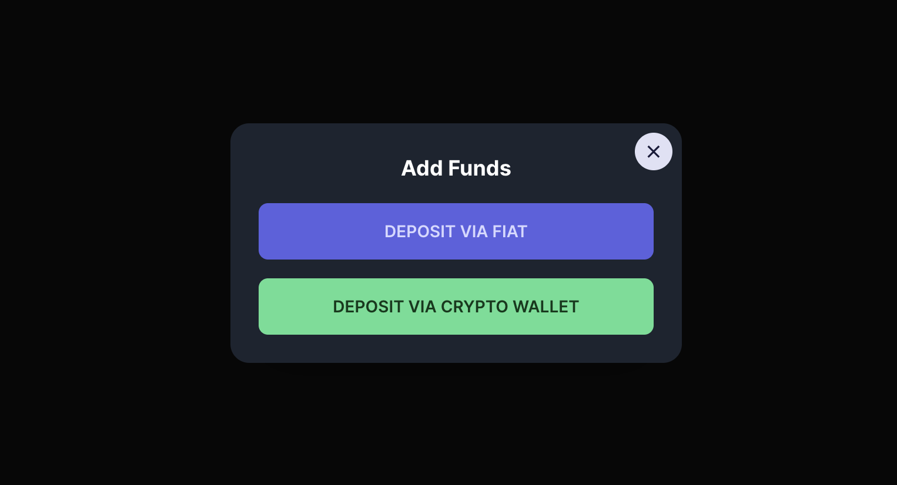
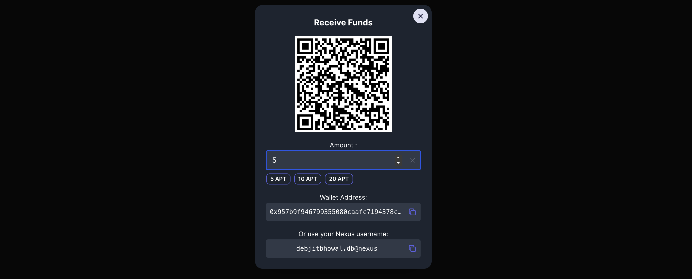
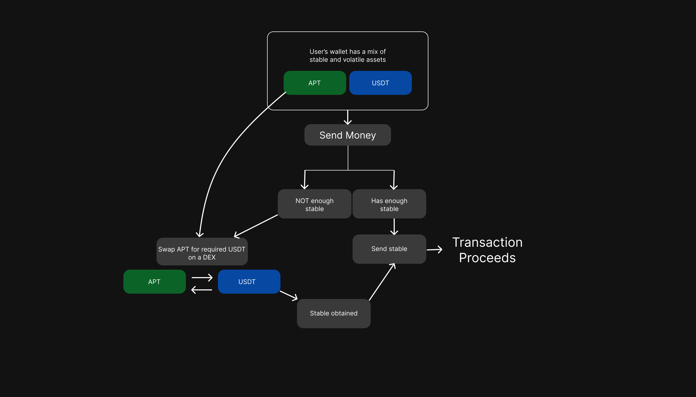

# Nexus Pay

Open, decentralized, cross-border payments with instant-finality and low fees. Nexus pay is a p2p and merchant payment platform.

## On-device, cross-device

Login with Google to create a wallet that can be accessed from any device, anywhere in the world. Neither our servers, nor any third party can access your wallet or funds. You can use this wallet on any device you log in with Google.

## Easy on ramp

Deposit money from other wallets or your credit card. Easily get into Nexus, with several payment modes, including bank transfer or cards. Or just deposit from another wallet if you want to go full off-grid. Currently we use a third party service to facilitate on-ramp, but we are working on an easier option soon.

## Scan, Pay, Go

Use your unique Nexus-ID or QR code to accept or send payments. Just scan the QR code, enter amount, and done. Merchants can use the QR code at their storefronts so anyone with a Nexus Pay wallet can send money.

Due to our close integration with your email, you can also send money to anyone with an email address if they have a Nexus Pay wallet.

## Stable payments

Pay without worrying about volatility. Enter the amount in $USD. We send an equivalent amount of stable coin, or internally convert from your APT balance to USDT so the receiver always receives funds in a coin which doesn't fluctuate.

Merchants can directly price their products in $USD without factoring in the volatility of cryptocurrencies.

## Merchant SDK

Integrate a `Pay with Nexus` button on your frontend to accept $USD payments from Nexus Pay wallets. Simply provide the email address of the sender, and we'll let you know when the payment is successful.

More information on the [Nexus Pay Merchant SDK here](docs/merchant-sdk.md).