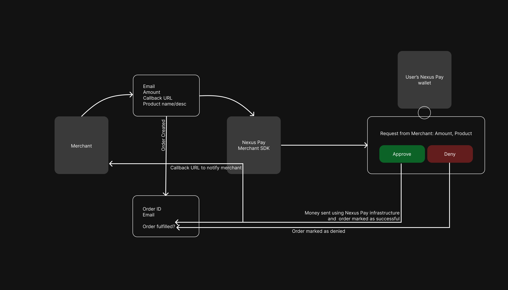

# Merchant SDK

Accept money from an email address.

The `Pay with Nexus` button is a simple way to accept payments from Nexus Pay wallets. It's equivalent to sending a payment request to the user's wallet. The user (the email address provided) will receive a notification in their Nexus Pay wallet to approve the payment. Upon approval, a callback will be sent to the merchant's server. Additionally, the merchant can query the Order ID to check the status of the payment.



## Integrate

The NexusPay SDK provides a customizable payment component for integrating Nexus Pay functionality into your application.

1. **Install SDK**:

```
npm i nexus-frontend-sdk
```

2. **Import SDK component in Your Frontend**:

```
import NexusPay from "nexus-frontend-sdk";
```

3. **Use the component in Frontend to Request Payment**:

```
const index = () => {
  const [handleOpen, setHandleOpen] = useState(false);
  return (
      <NexusPay
        name="Name you want to show on the user's approval box"
        details="The type of product etc. or some uniquely identifiable information"
        amount="10"
        token="USD"
        recipient_wallet= "0x..." // wallet address to send the payment to
        callback_url="https://merchant.example.com/callback" // optional
        open={handleOpen}
        onClick={() => setHandleOpen(true)}
        onClose={() => setHandleOpen(!handleOpen)}
      />
  );
};

export default index;
```

## Props

| Prop      | Type     | Description                                                |
| --------- | -------- | ---------------------------------------------------------- |
| `name`    | string   | The name or title of the payment component.                |
| `details` | string   | A brief description or details about the payment.          |
| `amount`  | string   | The payment amount.                                        |
| `open`    | boolean  | Controls the visibility of the payment component.          |
| `token`    | string  | Can accept USD or APT as input and user can pay that token.|
| `onClick` | function | Callback function triggered when the component is clicked. |
| `onClose` | function | Callback function triggered when the component is closed.  |
| `recipient_wallet` | string | Nexus wallet address to whom payment will go to.    |
| `callback_url` | string | URL to send a callback to when the payment is successful.    |

## Logic flow

Upon making the request, you will receive an ID for the payment. The response looks like:
    
```json
{
    "name": "Name you entered",
    "details": "Details you entered",
    "amount": "Amount you entered",
    "token": "The token you entered, default USD",
    "callback_url": "The callback URL you entered",
    "recipient_wallet": "The wallet address you entered",
    "id": "Order ID field",
    "is_filled": false,
    "timestamp": "Timestamp of the request"
}
```

This ID can be used to check the status of the payment. The user will receive a notification in their Nexus Pay wallet to approve the payment. Upon approval, a callback will be sent to the merchant's server. The merchant can query the Order ID to check the status of the payment.

## Callback function

Nexus Pay makes a POST request to the merchant's callback URL with the following payload:

```json
{
  "id": "order_id",
  "tx_hash": "<transaction_hash of the payment>",
}
```

Once the order successfully completes, when you query the order ID, you will receive a response like:

```json
{
    "name": "Name you entered",
    "details": "Details you entered",
    "amount": "Amount you entered",
    "token": "The token you entered, default USD",
    "callback_url": "The callback URL you entered",
    "recipient_wallet": "The wallet address you entered",
    "id": "Order ID field",
    "is_filled": true,
    "tx_hash": "Transaction hash of the payment",
    "timestamp": "Timestamp of the request"
}
```

Notice that the `is_filled` field is now `true`, and the new field `tx_hash`, which contains the transaction hash of the payment for you to verify yourself.